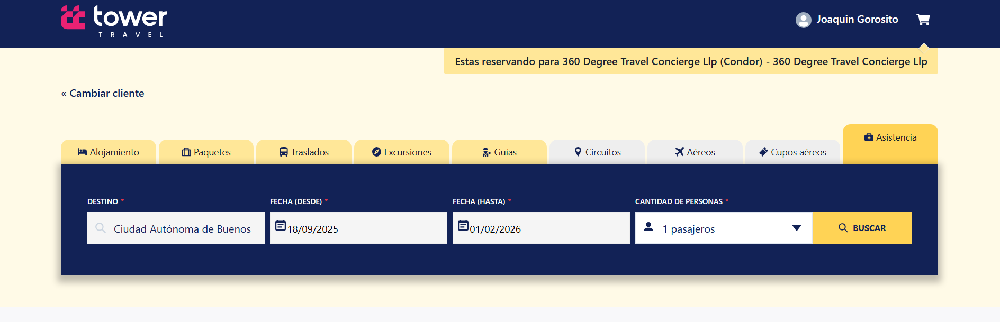

- **Solapa Asistencias**: Al tildar la solapa Asistencias deberá completar los campos **Destino**, **Fecha (desde)**, **Fecha (hasta)** y **cantidad de personas** y luego hacer clic en el botón **Buscar**.  
- **Destino**: Campo que permite escribir el punto final del recorrido. Campo desplegable y obligatorio.  
- **Fecha (desde)**: Campo que indica el día de inicio de la asistencia. Campo tipo fecha y obligatorio.  
- **Fecha (hasta)**: Campo que indica el día de finalización de la asistencia. Campo tipo fecha y obligatorio.  
- **Cantidad de personas**: Se refiere al número total de individuos involucrados en la asistencia.  

