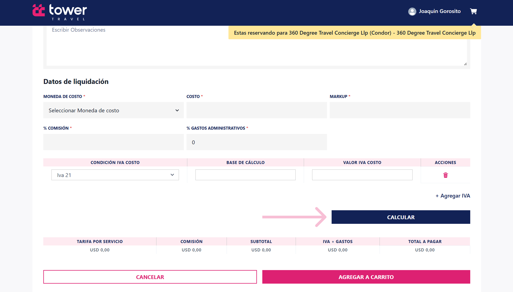

 Seguidamente podrá hacer clic en el botón *calcular*  
  para que el sistema genere automáticamente los  
  valores de los campos posteriores y por último  
  deberá hacer clic en *Agregar al Carrito*.

Los campos a calcular son los siguientes:  

- *Tarifa por servicio*  
- *Comisión*  
- *Subtotal*  
- *IVA + Gastos*  
- *Total a pagar*

