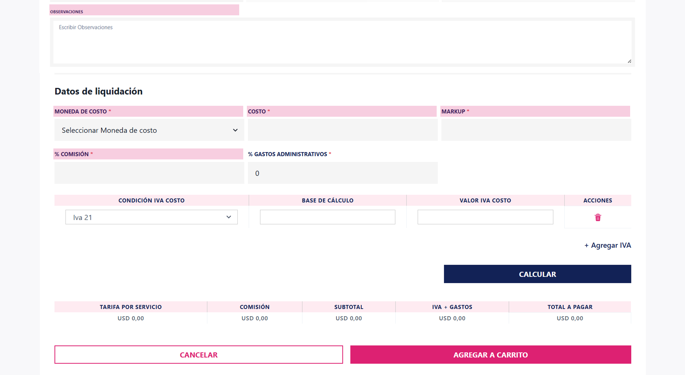

- **Observaciones:** Se utiliza para anotar comentarios, aclaraciones o información adicional que no encaja en los otros campos.  

- **Datos de Liquidación**

- **Moneda de Costo:** Campo donde podrá escribir las tres (3) primeras letras y se visualizará un listado del tipo de moneda a utilizar, o escribiendo tres puntos (…) se despliega un listado de los diez (10) primeros registros, de uso obligatorio.  

- **Costo:** Se refiere al valor monetario que representa el precio de la asistencia, campo numérico y de uso obligatorio.  

- **Markup:** Es la diferencia entre precio y costo.  

- **Comisión:** Se refiere al importe que se recibe como parte de una venta o prestación de un servicio, campo numérico y de uso obligatorio.  

- Luego de hacer clic en el botón **agregar al carrito** y el sistema mostrará un mensaje indicando que el **producto se agregó con éxito**.

