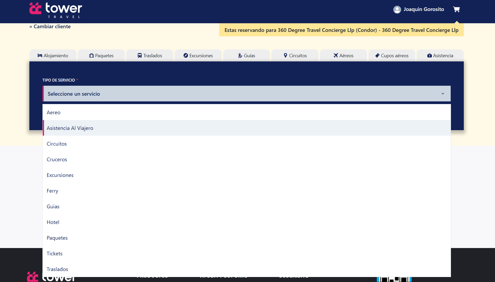

# Reservas Online
Creación de una Reserva - Eventuales

- Al agregar cualquiera de los servicios, se deberá completar todos los campos correspondientes.  

- Todos los servicios tienen los mismos campos a completar, solo se hará la demostración de dos en este manual.  

- Deberá hacer clic en seleccionar servicio para agregar una **Asistencia al viajero**.  

