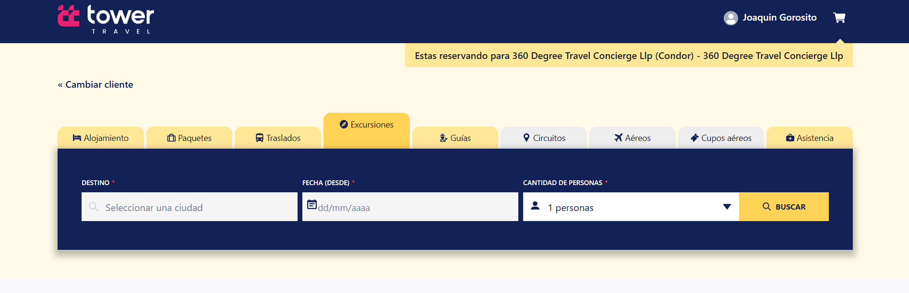

- **Solapa Excursión:** Al tildar la solapa Excursiones deberá completar los campos **Destino, Fecha (desde) y cantidad de personas** y luego hacer clic en el botón **Buscar**.

- **Destino:** Campo que permite escribir el punto final del recorrido. Campo desplegable y de uso obligatorio.

- **Fecha (desde):** Campo que indica el día de inicio de la excursión, campo tipo fecha y de uso obligatorio.

- **Cantidad de personas:** Se refiere al número total de individuos involucrados en la reserva de la excursión.

