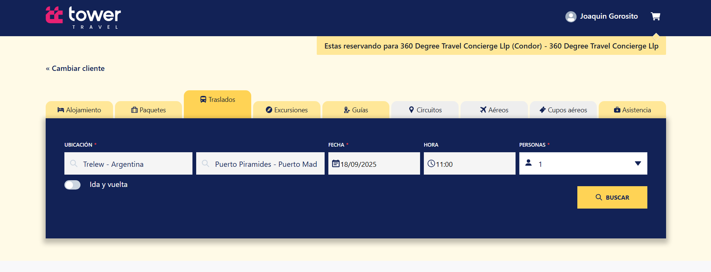

- **Solapa Traslado:** Al tildar la solapa Traslado deberá completar los campos **Ubicación, Fecha, Hora** y **Personas** y luego hacer clic en el botón **Buscar**.

- **Ubicación:** Se refiere al lugar geográfico o punto específico relacionado al servicio, campo desplegable y de uso obligatorio.
- **Fecha:** Se refiere al día específico en el calendario en que ocurre, se registra o se programa el servicio, campo tipo fecha y de uso obligatorio.
- **Hora:** Indica el momento exacto del día (expresado en horas y minutos) en que ocurre, comienza o finaliza el servicio, campo numérico y de uso obligatorio.
- **Personas:** Se refiere al número total de individuos involucrados en el servicio, campo numérico y de uso obligatorio.

